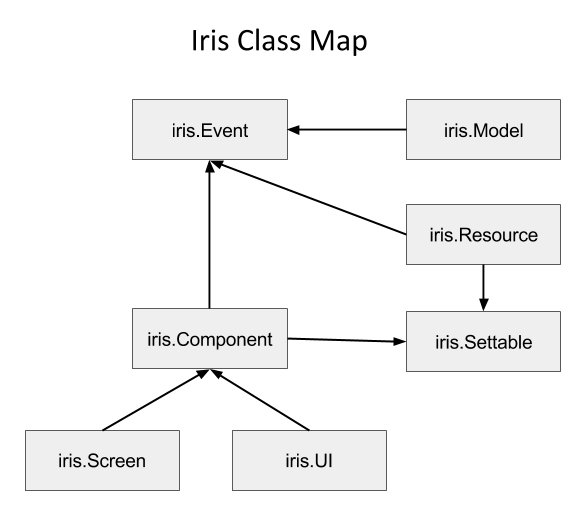
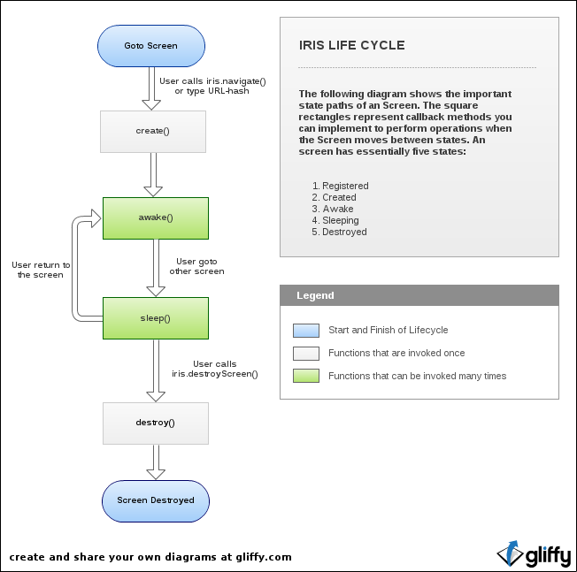

[Iris homepage](https://github.com/thegameofcode/iris) | [Documentation table of contents](toc.md)

# The iris API

Iris exposes all of its methods and properties on the `iris` object:

- [Core](#core)
	- [iris.baseUri([path])](#irisbaseuripath)
	- [iris.cache([enabled])](#iriscacheenabled)
	- [iris.cacheVersion([value])](#iriscacheversionvalue)
	- [iris.noCache(args)](#irisnocacheargs)
	- [iris.enableLog(args)](#irisenablelogargs)
	- [iris.log(args)](#irislogargs)
	- [iris.isLocalhost()](#irisislocalhost)
- [Util](#util)
	- [iris.ajax(settings)](#irisajaxsettings)
	- [iris.val(obj, label)](#irisvalobj-label)
	- [iris.date(date, format)](#irisdatedate-format)
	- [iris.number(number, config)](#irisnumbernumber-config)
	- [iris.currency(amount, config)](#iriscurrencyamount-config)
	- [iris.browser()](#irisbrowser)
	- [iris.inherits(subClass, superClass)](#irisinheritssubclass-superclass)
- [Event](#event)
	- [Iris events examples](#iris-events-examples)
		- [Iris object example](#iris-object-example)
		- [UI example](#ui-example)
		- [Screen example](#screen-example)
		- [Model example](#model-example)
		- [Resource example](#resource-example)
	- [Global Iris Events](#global-iris-events)
		- [iris.BEFORE_NAVIGATION](#irisbefore_navigation)
		- [iris.AFTER_NAVIGATION](#irisafter_navigation)
		- [iris.RESOURCE_ERROR](#irisresource_error)
		- [iris.SCREEN_NOT_FOUND](#irisscreen_not_found)
- [Language & Regional](#language--regional)
	- [iris.translate(text[, locale])](#iristranslatetext-locale)
	- [iris.translations(locale, [terms]|[file, [callbacks]])](#iristranslationslocale-termsfile-callbacks)
	- [iris.locale([locale][, regional])](#irislocalelocale-regional)
	- [iris.regional([label])](#irisregionallabel)
- [Components](#components)
	- [iris.include(paths, callback)](#irisincludepaths-callback)
	- [iris.welcome(path)](#iriswelcomepath)
	- [iris.navigate(path)](#irisnavigatepath)
	- [iris.screen(function(self){...}, path)](#irisscreenfunctionself-path)
	- [iris.destroyScreen(path)](#irisdestroyscreenpath)
	- [iris.ui(function(self){...}, path)](#irisuifunctionself-path)
	- [iris.tmpl(path, html)](#iristmplpath-html)
	- [iris.resource(function(self){...}, path)](#irisresourcefunctionself-path)
	- [iris.debug(enabled)](#irisdebugenabled)
- [Classes](#classes)
	- [Iris Class Map](#iris-class-map)
	- [iris.Settable Class](#irissettable-class)
		- [self.setting(label[, value])](#selfsettinglabel-value)
		- [self.settings(params)](#selfsettingsparams)
	- [iris.Event class](#irisevent-class)
		- [iris.Event.events(args)](#iriseventeventsargs)
		- [iris.Event.checkEvent(eventName)](#iriseventcheckeventeventname)
		- [iris.Event.on(eventName, listener)](#iriseventoneventname-listener)
		- [iris.Event.once(eventName, listener)](#iriseventonceeventname-listener)
		- [iris.Event.off(eventName[, listener])](#iriseventoffeventname-listener)
		- [iris.Event.notify(eventName[, parameter])](#iriseventnotifyeventname-parameter)
		- [iris.Event.notifyOn()](#iriseventnotifyon)
		- [iris.Event.notifyOff()](#iriseventnotifyoff)
		- [iris.Event.listen(target, eventName, listener[, weakReference])](#iriseventlistentarget-eventname-listener-weakreference)
		- [iris.Event.pauseListeners()](#iriseventpauselisteners)
		- [iris.Event.resumeListeners()](#iriseventresumelisteners)
		- [iris.Event.removeListeners()](#iriseventremovelisteners)
	- [iris.Component Class](#iriscomponent-class)
		- [self.tmpl(path)](#selftmplpath)
		- [self.get([data-id])](#selfgetdata-id)
		- [self.inflate(data)](#selfinflatedata)
		- [self.ui(container_id, path[, settings, tmpl_mode])](#selfuicontainer_id-path-settings-tmpl_mode)
		- [self.destroyUI([ui_component])](#selfdestroyuiui_component)
		- [self.destroyUIs(container_id)](#selfdestroyuiscontainer_id)
	- [iris.UI Class](#irisui-class)
		- [UI life cycle](#ui-life-cycle)
		- [self.tmplMode(mode)](#selftmplmodemode)
	- [iris.Screen Class](#irisscreen-class)
		- [Screen life cycle](#screen-life-cycle)
		- [self.param(name)](#selfparamname)
		- [self.screens(container_id, screens)](#selfscreenscontainer_id-screens)
	- [iris.Resource Class](#irisresource-class)
		- [Resource life cycle](#resource-life-cycle)
		- [self.get(path, success, error)](#selfgetpath-success-error)
		- [self.post(path, params, success, error)](#selfpostpath-params-success-error)
		- [self.put(path, params, success, error)](#selfputpath-params-success-error)
		- [self.del(path, success, error)](#selfdelpath-success-error)
	- [iris.Model Class](#irismodel-class)
		- [Model life cycle](#model-life-cycle)
		- [iris.Model.defaults(attributes)](#irismodeldefaultsattributes)
		- [iris.Model.get(key)](#irismodelgetkey)
		- [iris.Model.set(attributes)](#irismodelsetattributes)
		- [iris.Model.unset(key)](#irismodelunsetkey)


## Core

### iris.baseUri([path])
*Since*: `v0.5.0`

Set the base URL applied to load Iris components like screens, UIs & resources.

```javascript
// You can define paths as
iris.path = {
		screen : { 
				js: "./path/to/iris/components/screen.js",
				html: "./path/to/iris/components/screen.html"
		}
};

// Or you can use iris.baseUri to short paths
iris.path = {
		screen : { 
				js: "screen.js",
				html: "screen.html"
		}
};
iris.baseUri("./path/to/iris/components/");
```

### iris.cache([enabled])
*Since*: `v0.5.0`

Set or get a boolean value that indicates whether Iris' calls are cached or not.
In local environments (localhost, 127.0.0.1) the cache are disabled by default.

```javascript
// Getter
iris.cache();

// Setter
iris.cache(true);
```

### iris.cacheVersion([value])
*Since*: `v0.5.0`

Set or get a value that will be added as query parameter in all Iris' ajax calls.
You can use it to force Iris' components to be cached with a version string.
By default cache version is disabled.

```javascript
// Getter
iris.cacheVersion();

// Setter
iris.cacheVersion("v1.0");
```

### iris.noCache(args)
*Since*: `v0.5.0`

Disable browser cache adding a timestamp param (e.g.: url?_=1374053849520) on each HTTP call when the environment match with the current URL.

```javascript
// By default iris executes:
iris.noCache("localhost", "127.0.0.1");
```

### iris.enableLog(args)
*Since*: `v0.5.0`

Enable or disable the *iris.log* outputs according to the current URL.

```javascript
// Enable logs only in development hosts
iris.enableLog("localhost", "dev.example.com", "int.example.com");
```

Since `v0.5.5`, you can enable or disable iris logs using a boolean, e.g.:

```javascript
iris.enableLog(false); // Disable all iris logs
```


### iris.log(args)
*Since*: `v0.5.0`

Prints the parameters values to the console for debugging purposes.
If logging is disabled, it doesn't print any.
To enable or disable logging use `iris.enableLog`.
It uses the native `console.log` and works in all modern browsers and IE8+.

```javascript
// Basic example
iris.log("Hello world!");
```

```javascript
// Multiple parameters
iris.log("obj = ", obj, " obj2 = ", obj2);
```

```javascript
// Enable logs only in the development machine
iris.enableLog("127.0.1.30");

iris.log("This is only printed in 127.0.1.30");
```

### iris.isLocalhost()
*Since*: `v0.5.7`

Returns `true` if `document.location.href` contains `localhost` or `127.0.0.1`.

```javascript
if ( iris.isLocalhost() ) {
	// do something
}
```


## Util
### iris.ajax(settings)
*Since*: `v0.5.0`

Perform an HTTP (Ajax) request.
Accepts the same parameters as *jQuery.ajax()*
See <a href="http://api.jquery.com/jQuery.ajax/">JQuery Ajax</a> for more details.
Returns a jQuery [jqXHR](http://api.jquery.com/Types/#jqXHR) object.

```javascript
iris.ajax({
	"url" : "http://www.example.com/",
	"type" : "GET"
}).done(successCallback).fail(errorCallback);
```

### iris.val(obj, label)
*Since*: `v0.5.0`

Get value from Javascript object using a label string.
You can use dot to get object's children.

```javascript
var book = {
		author : {
				name : "value"
		}
};

var authorName = iris.val(book, "author.name");
```


### iris.date(date, format)
*Since*: `v0.5.0`

Formats a Date object or timestamp to the specified format and according to the current locale.
See [Language & Regional](#language--regional) for more information.
You can use the following special characters:

* __a__ 'a.m.' or 'p.m.'
* __A__ 'AM' or 'PM'
* __b__ Month, textual, 3 letters, lowercase. 'jan'
* __d__ Day of the month, 2 digits with leading zeros. '01' to '31'
* __D__ Day of the week, textual, 3 letters. 'Fri'
* __F__ Month, textual, long. 'January'
* __h__ Hour, 12-hour format. '01' to '12'
* __H__ Hour, 24-hour format. '00' to '23'
* __i__ Minutes. '00' to '59'
* __l__ Day of the week, textual, long. 'Friday'
* __m__ Month, 2 digits with leading zeros. '01' to '12'
* __M__ Month, textual, 3 letters. 'Jan'
* __n__ Month without leading zeros. '1' to '12'
* __s__ Seconds, 2 digits with leading zeros. '00' to '59'
* __U__ Seconds since the Unix Epoch (January 1 1970 00:00:00 UTC)
* __y__ Year, 2 digits. '99'
* __Y__ Year, 4 digits. '1999'

```javascript
iris.date(new Date(),"ymd");

iris.date(1331954654564,"d/m/y h:i:s"); // "17/03/12 04:24:14"

iris.date("Thu Feb 14 2013 12:42:49 GMT+0100 (CET)", "d-m-Y"); // "14-02-2013"
```

### iris.number(number, config)
*Since*: `v0.5.0`

Formats a number according to the current locale or `config` values.
See [Language & Regional](#lang) for more information.
Default `config` value are:

```javascript
{
		formatPos: "n",
		formatNeg: "- n",
		decimal: ".",
		thousand: ",",
		precision: 2
}
```

e.g. :

```javascript
iris.locale(
		"es_ES", {
				number : {
						decimal: ",",
						thousand: ".",
						precision: 2
				}
		}
);

iris.number(5600.899); // "5.600,90"

iris.number(5600.899, { precision: 0 }); // "5.601"

iris.number(5600.899, {
		decimal: ".",
		thousand: ",",
		precision: 1
}); // "5,600.9"

```

### iris.currency(amount, config)
*Since*: `v0.5.0`

Formats a amount according to the current locale or `config` values.
See [Language & Regional](#lang) for more information.
Default `config` value are:

```javascript
{
		formatPos: "sn",
		formatNeg: "(sn)",
		symbol : "$"
}
```

e.g. :

```javascript
iris.locale(
		"es_ES", {
				currency : {
						formatPos: "n s",
						formatNeg: "- n s",
						decimal: ",",
						thousand: ".",
						precision: 2,
						symbol : "$"
				}
		}
);

iris.currency(5600.899); // "5.600,90 €"

iris.currency(-5600.899); // "- 5.600,90 €"

iris.currency(5600.899, { symbol : "" }); // "5.600,90"

```

### iris.browser()
*Since*: `v0.5.1`

Returns an object with the browser information using user-agent.
It contains flags for each of the four most prevalent browser classes (Internet Explorer, Mozilla, Webkit, and Opera) as well as version information.
Because it uses `navigator.userAgent` to determine the platform, it is vulnerable to spoofing by the user or misrepresentation by the browser itself. It is always best to avoid browser-specific code entirely where possible. 

Available flags are:
 * chrome
 * webkit
 * safari
 * opera
 * msie
 * mozilla

*Example*: Returns true if the current useragent is some version of Microsoft's Internet Explorer:
```javascript
iris.browser().msie;
```

*Example*: Show the browser info object:
```javascript
console.log( iris.browser() );
```

### iris.inherits(subClass, superClass)
*Since*: `v0.5.5`

Inheritance with the prototype chain.

```javascript
// Basic example

// SuperClass
function Mammal (name) {
  this.name = name;
}
Mammal.prototype.sayName = function() { 
	console.log('[Mammal "' + this.name + '"]');
}

// SubClass
function Cat (name) {
  Mammal.call(this, name); // Call SuperClass constructor
}

// Cat will inherit the Mammal prototyped functions
iris.inherits(Cat, Mammal);

var kitty = new Cat('Kitty');
kitty.sayName(); // [Mammal Kitty]

```


## Event
*Since*: `v0.6.0`

The global `iris` object and the classes [iris.UI](#irisui-class), [iris.Screen](#irisscreen-class), [iris.Model](#irismodel-class) and [iris.Resource](#irisresource-class) inherits methods and properties from [iris.Event](#irisevent-class) class.  See [Iris Class Map](#iris-class-map) for more details.

### Iris events examples

#### iris object example

```javascript
// The global iris object inherits iris.Event methods and properties
iris.on(iris.BEFORE_NAVIGATION, function () {
	iris.log("before navigation : " + document.location.hash)
});
```

#### UI example

```javascript
// UIs can trigger events
iris.ui(function (self) {

    self.events('example-event');

	self.create = function() {
		self.notify('example-event');
	}

}, iris.path.ui.example.js);

// Add or remove event listener to UIs
var myUi = self.ui('container-data-id', iris.path.ui.example.js);
myUi.on('example-event', fn);
myUi.off('example-event', fn);
```


#### Screen example

```javascript
// Screens can trigger events
iris.screen(function (self) {

    self.events('example-event');

	self.create = function() {
		self.notify('example-event');
	}

}, iris.path.screen.example.js);

// Add or remove event listener to screens
// Notes that screens can not be instantiated
var myScreen = self.setting('myScreen');
myScreen.on('example-event', fn);
myScreen.off('example-event', fn);
```


#### Model example

```javascript
// Models can trigger events
iris.model(function (self) {

    self.events('example-event');

	self.create = function() {
		self.notify('example-event');
	}

}, iris.path.model.example.js);

// Add or remove event listener to models
var myModel = iris.model(iris.path.model.example.js, data);
myModel.on('example-event', fn);
myModel.off('example-event', fn);
```


#### Resource example

```javascript
// Resources can trigger events
iris.resource(function (self) {

    self.events('example-event');

	self.create = function() {
		self.notify('example-event');
	}

}, iris.path.resource.example.js);

// Add or remove event listener to resources
var myResource = iris.resource(iris.path.resource.example.js);
myResource.on('example-event', fn);
myResource.off('example-event', fn);
```


### Global Iris Events

#### iris.BEFORE_NAVIGATION
*Since*: `v0.5.0`

Triggered before do a navigation.

```javascript
iris.on(iris.BEFORE_NAVIGATION, function () {
		iris.log("before navigation : " + document.location.hash)
});
```

#### iris.AFTER_NAVIGATION
*Since*: `v0.5.0`

Triggered after do a navigation.

```javascript
iris.on(iris.AFTER_NAVIGATION, function () {
		iris.log("after navigation : " + document.location.hash)
});
```

#### iris.RESOURCE_ERROR
*Since*: `v0.5.0`

Triggered when a resource ajax call fails.

```javascript
iris.on(iris.RESOURCE_ERROR, function (request, textStatus, errorThrown) {
		iris.log("resource error", request, textStatus, errorThrown);
});
```

#### iris.SCREEN_NOT_FOUND
*Since*: `v0.5.2`

Triggered when a navigation fails.

```javascript
iris.on(iris.SCREEN_NOT_FOUND, function (path) {
	iris.log("Upss, path[" + path + "] not found");

	// Use location.replace instead of iris.navigate or location.hash
	window.location.replace("#/404"); // navigation without history saving
});
```

## Language & Regional
### iris.translate(text[, locale])
*Since*: `v0.5.0`

Translates a text using the locale.

```javascript
// Add the translations
iris.translations("es_ES", {GREETING : "Saludos"})

iris.translate("GREETING", "es_ES");
iris.translate("GREETING"); // Using default locale ( iris.locale() )
```
If no locale is passed, Iris will use the default locale.


### iris.translations(locale, [terms]|[file, [callbacks]])
*Since*: `v0.5.0`

Adds translations in a particular language. This method can be called multiple times with the same language.

*terms*: Object containing the definitions in format *text: definition*. It admits a multi level hierarchy. See example.

*file*: Path to a file with the terms definitions in JSON format.

Object with two attributes (*success* and *error*) containing the functions called after retrieve the terms.

```javascript
iris.translations("en_US", {
		GREETING: "Hi!",
		GREETINGS: {
				MORNING: "Good Morning",
				AFTERNOON: "Good Afternoon",
				NIGHT: "Good Night"
		}
});
```

The translations can be in a JSON file. The call is asynchronous.

```javascript
iris.translations("fr_FR", "./lang_FR.json", {"success" : onFRSuccess, "error" : onFRError });
```

### iris.locale([locale][, regional])
*Since*: `v0.5.0`

Defines or gets the locale format.
You can use the [available locales](../localization).

```javascript
//Example of regional definition. Sets de locale to "en_US" if locale is not set:
iris.locale(
		"en_US", {
				dayNames: ["Sunday", "Monday", "Tuesday", "Wednesday", "Thursday", "Friday", "Saturday"],
				monthNames: ["January", "February", "March", "April", "May", "June", "July", "August", "September", "October", "November", "December"],
				dateFormat: "m/d/Y h:i:s",
				currency: {
						formatPos: "s n",
						formatNeg: "(s n)",
						decimal: ".",
						thousand: ",",
						precision: 2,
						symbol: "$"
				},
				number : {
						decimal: ".",
						thousand: ",",
						precision: 2
				}
		}
);
```


```javascript
//To set the locale
iris.locale("en_US");

//To get the current locale
var locale = iris.locale();
```

### iris.regional([label])
*Since*: `v0.5.0`

Gets a regional value according to the setting locale.

If *label* is not passed, returns all the regional definition.

```javascript
iris.regional("dayNames");
```

## Components

### iris.include(paths, callback)
*Since*: `v0.5.1`

Load the components using the `paths` array parameter. When all files are loaded, executes the `callback` function.
You can load and use iris resources before call to the `iris.welcome` function, eg:

```javascript
iris.path = {
	user_resource : "resource/user.js",
	welcome : "screen/welcome.js"
};

iris.include([iris.path.user_resource], function () {
	
	iris.resource(iris.path.user_resource).checkUserInSession().done(loginDone).fail(loginFail);

});

function loginDone () {
	iris.welcome(iris.path.welcome);
}

function loginFail () {
	alert("forbidden");
}

```
You can load external JS files, e.g.:

```js
iris.include(["http://www.example.com/js/file.js", "http://www.example.com/js/file2.js"], function(){
  console.log("file.js & file2.js has been loaded.");
});
```

### iris.welcome(path)
*Since*: `v0.5.0`

The welcome screen is the root of all screens.
You must define always the welcome screen in your initial script.
This function establishes the welcome screen and navigates to it.

```javascript
// All Iris applications start in the welcome screen
// Remember to define iris.path before
iris.welcome(iris.path.welcome.js);
```

### iris.navigate(path)
*Since*: `v0.5.0`

Navigates to a screen changing the hash URL (this function is equivalent to `document.location.hash = path`).

Iris looks for the target screen using the hash URL (`path` parameter) and wakes the target screen and its parents. The previous screens will sleep, if its `canSleep()` functions allows it. The screens are not destroyed, the screens change their status to sleeping. If you want destroy the hidden screens, use [iris.destroyScreen(path)](#irisdestroyscreenpath). Use [self.screens(container_id, screens)](#selfscreenscontainer_id-screens) inside screen to define screen childs. When a parameter value is changed, the screen awake function is called again (the same for its child screens). The welcome screen never can sleep, it is always visible. Show the [lifecycle](lifecycle.md) for more details.

The [iris.BEFORE_NAVIGATION](#irisbefore_navigation) event is triggered on new navigation. When the navigation finished [iris.AFTER_NAVIGATION](#irisafter_navigation) is triggered. If the screen is not found the [iris.SCREEN_NOT_FOUND](#irisscreen_not_found) event is notified.

You can use the matrix paramaters (`;name=value;name2=value2...`) to send them data, e.g.: `#;param0=value0/screen1;param1=value1;param2=value2/screen2`
In this example the welcome screen receives `param0`, screen1 receives `param1` & `param2`, the screen2 doesn't receive any parameter. Use [self.param(name)](#selfparamname) inside the screen to retrieve parameter values.

```javascript

// Navigate without params
iris.navigate("#/screen1/child_of_screen1");

// Send parameters to the welcome screen
iris.navigate("#;param=value/screen1/child_of_screen1");

// Send parameters to other screen
iris.navigate("#/screen1;param=value;param2=value2/child_of_screen1");

// More examples

// To get the param value, use self.param('mode') inside welcome screen
iris.navigate('#;mode=offline/dashboard');

// If the param is changed, the welcome screen awake function
// is called (the same for its child screens)
iris.navigate('#;mode=online/dashboard');

// If you want to navigate to another screen, the dashboard screen
// will sleep and otherscreen will wake up
iris.navigate('#;mode=online/otherscreen');


// Another examples
iris.navigate('#/book/17354;show=details');

iris.navigate('#/user/me/friends;filter=all;show=nearest');

```

### iris.screen(function(self){...}, path)
*Since*: `v0.5.0`

Defines a Screen component.

```javascript
iris.screen(

 function (self) {

	//Called once when the Component is created
	self.create = function () {
	 self.tmpl(iris.path.screen.example.html);
	};

	//Called when the Component is showed.
	self.awake = function () {
	 ...
	};

	//Called when the component is hidden because you navigate to another Screen
	self.sleep = function () {
	 ...
	};

	//Called before sleep()
	//If the method returns false, the navigation is interrupted and not hidden nor self.seelp method is called
	//This method only is applied to the Screens components
	self.canSleep = function () {
	 ...
	};


	//Called when the component is destroyed
	self.destroy = function () {
	 ...
	};

 }, iris.path.screen.example.js  
);
```

### iris.destroyScreen(path)
*Since*: `v0.5.0`

Destroys a Screen component. Cannot delete the current screen or its parents.

```javascript
iris.destroyScreen('#/user/help');
```

### iris.ui(function(self){...}, path)
*Since*: `v0.5.0`

Defines an UI Component.

```javascript
iris.ui(function(self){...});
```

### iris.tmpl(path, html)
*Since*: `v0.5.0`

Loads the template in memory and associates it to a path.

```javascript
iris.tmpl("screen/welcome.html","<div>...</div>");
```
See `self.tmpl` for more details.

### iris.resource(function(self){...}, path)
*Since*: `v0.5.0`

Defines or creates a Resource Component.

```javascript
//To define
iris.resource(function(self){

		//Some RESTful methods
		self.load = function (id) {
			return self.get("service/book/" + id);
		};

		self.create = function (params) {
			return self.post("service/book", params);
		};

		self.update = function (id, params) {
			return self.put("service/book/" + id, params);
		};

		self.remove = function (id) {
			return self.del("service/book/" + id);
		};

}, iris.path.resource.js);
```

```javascript
//To create
iris.resource(iris.path.resource.js);
```

### iris.debug(enabled)
*Since*: `v0.5.7`

Enables or disables the iris debug mode.
When iris debug mode is enabled, the application is listening for the combination of keys: <kbd>Ctrl + Alt + Shift + D</kbd> to show or hide the debug information layer. By default it is enabled in local enviroments (`127.0.0.1` and `localhost`).
If the the combination of keys is detected, the application prints/hide a visual lines to highlight the components (screens and UIs) and prints information about its presenter and template paths, hash-URL or data-id.

```javascript
// Force to disable iris debug mode
//('Ctrl + Alt + Shift + D' wont work)
iris.debug(false);
```

### iris.model(function(self){...}, path)
*Since*: `v0.6.0`

Defines or creates a Model Component.

```javascript
//To define
iris.model(function(self){

		self.defaults = {user: 'unkown'};

		self.create = function () {
			//Called when the model is created
		};

		self.destroy = function () {
			//Called when the model is destroyed. A 'destroy' event is notified
		};

}, iris.path.model.js);
```

```javascript
//To create
var model = iris.model(iris.path.model.js);
```

## Classes


### Iris Class Map

The iris object exposes multiple classes. The following image shows how the Iris classes are related:




### iris.Settable Class

_iris.Settable_ is superclass of [iris.Component](#iriscomponent-class) and [iris.Resource](#irisresource-class). See [Iris Class Map](#iris-class-map) for more details.


#### self.setting(label[, value])
*Since*: `v0.5.0`

Gets o sets a value attribute.

```javascript
//To set
self.setting("attribute_name", {...});
```

```javascript
//To get
var attribute_value = self.setting("attribute_name");
```

#### self.settings(params)
*Since*: `v0.5.0`

Sets multiples and complex attributes values.

```javascript
self.settings({ person: { name:"test name"}, money: -67890.678, region: { country: "country test" }});
var attribute_value = self.setting("person.name");
```


### iris.Event class

_iris.Event_ is superclass of [iris.Component](#iriscomponent-class), [iris.Model](#irismodel-class) and [iris.Resource](#irisresource-class) classes. See [Iris Class Map](#iris-class-map) for more details.

#### iris.Event.events(args)
*Since*: `v0.6.0`

Define allowed events. This a way to indicate what events can manage an object. When [iris.Event.on(eventName, listener)](#iriseventoneventname-listener), [iris.Event.off(eventName[, listener])](#iriseventoffeventname-listener) or [iris.Event.notify(eventName[, parameter])](#iriseventnotifyeventname-parameter) are called, the first thing is to check if the event name is allowed, otherwise it raises an exception. Explicit registration of events is a good practice that helps developers to control component events.

```javascript
// First off, create a sample UI
iris.ui(function (self) {

	// This UI can trigger only events with these names
    self.events('update', 'change', 'refresh');

}, iris.path.ui.example.js);


// In another place, in a screen for example
iris.screen(function(self) {

	self.create = function() {
		...

		self.ui(iris.path.ui.example.js).on('refresh', onUpdate); // 'refresh' event is allowed

		self.ui(iris.path.ui.example.js).on('not_defined_event', onNotDefinedEvent); // throws an exception
	};


},iris.path.screen.welcome.js);
```

#### iris.Event.checkEvent(eventName)
*Since*: `v0.6.0`

Checks if the event name has been registered previously, otherwise throws an exception. Use [iris.Event.events(args)](#iriseventeventsargs) to register the component's allowed events before to notify them. This function is called from [iris.Event.on(eventName, listener)](#iriseventoneventname-listener), [iris.Event.off(eventName[, listener])](#iriseventoffeventname-listener) and [iris.Event.notify(eventName[, parameter])](#iriseventnotifyeventname-parameter).

```javascript
iris.model(function (self) {

	// Allowed methods
    self.events('toggle', 'change_title');

}, iris.path.model.example.js);


// In another place, in a UI for example
iris.ui(function(self) {

	self.create = function() {
		...

		var model = self.model(iris.path.model.example.js, {title: 'example'});

		model.checkEvent('change_title'); // 'change_title' event is allowed

		model.checkEvent('not_registered_event'); // throws an exception
	};


},iris.path.ui.example.js);
```

#### iris.Event.on(eventName, listener)
*Since*: `v0.6.0`

Add an event listener. __Warning__: you must be careful this may cause memory leaks.
Remember register the event name in the target using [iris.Event.events(args)](#iriseventeventsargs).

A common case of memory leaks:
- Create an UI and suscribe it to a model event
- Destroy the created UI (the listener is still referenced in the model)
- If you dont remove the listener before destroy it, the UI cannot be removed by the garbage collector

To prevent memory leaks use the [iris.Event.listen(target, eventName, listener[, weakReference])](#iriseventlistentarget-eventname-listener-weakreference) instead of _iris.Event.on(eventName, listener)_ and call to [iris.Event.removeListeners()](#iriseventremovelisteners) on destroy.

```javascript

iris.model(function (self) {

	// Allowed methods
    self.events('complete');

}, iris.path.model.example.js);


// In another place, in a screen for example
iris.screen(function(self) {

	function onModelComplete () {
		console.log('the model is complete!');
	}

	self.create = function() {
		...

		var model = self.model(iris.path.model.example.js, {title: 'example'});

		model.on('complete', onModelComplete);

	};

	self.destroy = function() {
		// Remember remove the listener in order to prevent memory leaks
		// We recommend use iris.Event.listen instead of iris.Event.on
		model.off('complete', onModelComplete);
	}


}, iris.path.screen.welcome.js);

```


#### iris.Event.once(eventName, listener)
*Since*: `v0.6.0`

Just like [iris.Event.on(eventName, listener)](#iriseventoneventname-listener), but causes the bound listener to only notify once before being removed.

```javascript
iris.events('test-event-for-once');

iris.once('test-event-for-once', function () {
	console.log('test-event-for-once');
});

iris.notify('test-event-for-once'); // Print 'test-event-for-once'
iris.notify('test-event-for-once'); // Don't print log
```


#### iris.Event.off(eventName[, listener])
*Since*: `v0.6.0`

Removes an event listener. If the `listener` is omitted, all component's listeners for `eventName` will be removed.

```javascript

// Iris event
iris.off(iris.BEFORE_NAVIGATION, onBeforeNavigation); // Unsubscribe one listener
iris.off(iris.BEFORE_NAVIGATION); // Remove all listeners

// Local event
iris.model(function (self) {

	self.events('refresh');

}, iris.path.model.example.js);

var target = iris.model(iris.path.model.example.js, {text:'example'});
target.on('refresh', callback1);
target.on('refresh', callback2);
target.off('refresh'); // Remove callback1 and callback2

```


#### iris.Event.notify(eventName[, parameter])
*Since*: `v0.6.0`

Trigger added callbacks for the given `eventName`. To add callbacks use [iris.Event.on(eventName, listener)](#iriseventoneventname-listener) or [iris.Event.listen(target, eventName, listener[, weakReference])](#iriseventlistentarget-eventname-listener-weakreference). The `parameter` object will be passed along to the event callbacks. Use [iris.Event.notifyOn()](#iriseventnotifyon) or [iris.Event.notifyOff()](#iriseventnotifyoff) to enable or disable this function.

```javascript

iris.ui(function(self) {

	self.create = function() {
		...
		// Remember register the event before
		self.events('user_cancel');

		// Without parameters
		self.notify('user_cancel');

		// With parameters
		var params = { userName: model.get('name'), location: _getLocation() };
		self.notify('user_cancel', params);
	};


}, iris.path.ui.example.js);
```


#### iris.Event.notifyOn()
*Since*: `v0.6.0`

Enable notification of events. The property `self.silent` will be `false`.
By default notifications are enabled. Use [iris.Event.notifyOff()](#iriseventnotifyoff) to disable them.

```javascript

iris.ui(function(self) {

	self.create = function() {
		...
		// Remember register the event before
		self.events('test_event');

		// Now this UI is silent
		self.notifyOff();

		// The event is not emitted
		self.notify('test_event');

		// Enable notifications again
		self.notifyOn();

		// The event is emitted
		self.notify('test_event');
	};


}, iris.path.ui.example.js);
```


#### iris.Event.notifyOff()
*Since*: `v0.6.0`

Disable notification of events. The property `self.silent` will be `true`.
By default notifications are enabled. Use [iris.Event.notifyOn()](#iriseventnotifyon) to enable them.

```javascript

iris.ui(function(self) {

	self.create = function() {
		...
		// Remember register the event before
		self.events('test_event');

		// Trigger event
		self.notify('test_event');

		// Now this UI is silent
		self.notifyOff();

		// The event is not emitted
		self.notify('test_event');
	};


}, iris.path.ui.example.js);
```


#### iris.Event.listen(target, eventName, listener[, weakReference])
*Since*: `v0.6.0`


The current object listen to a particular event (`eventName`) on the `target` object.
The advantage of using this form, instead of [iris.Event.on(eventName, listener)](#iriseventoneventname-listener), is that `listen` helps you to remove or pause/resume all listeners at once later on.

`weakReference` by default is false, it's mean the listener is added to the publisher and may cause memory leaks when the publisher is destroyed. If `weakReference` is true, it adds the event listener in a safe way to prevent memory leaks, because it subscribes to the publisher destroy event and remove the publisher reference from subscriber when the publisher is destroyed. Be careful, this behaviour avoid memory leaks, but the performance is decreased when objects are destroyed.

You can use [iris.Event.removeListeners()](#iriseventremovelisteners), [iris.Event.pauseListeners()](#iriseventpauselisteners) or [iris.Event.resumeListeners()](#iriseventresumelisteners) to manage them.

```javascript

iris.model(function (self) {

	// Allowed methods
    self.events('complete');

}, iris.path.model.example.js);


// In another place, in a UI for example
iris.ui(function(self) {

	function onModelComplete () {
		console.log('the model is complete!');
	}

	self.create = function() {
		...

		var model = self.model(iris.path.model.example.js, {title: 'example'});

		
		// And if model is destroyed, Iris will remove the listener too
		self.listen(model, 'complete', onModelComplete);

	};

	self.awake = function () {
		// This may be useful in some cases
		self.resumeListeners();
	};

	self.sleep = function () {
		// When the UI is asleep, the listeners will not called
		self.pauseListeners();
	};

	self.destroy = function () {
		// When this UI is destroyed, it will call to model.off('complete', onModelComplete)
		// to prevent memory leaks
		self.removeListeners();
	};


}, iris.path.ui.example.js);

```


#### iris.Event.pauseListeners()
*Since*: `v0.6.0`

Pause all listeners added using [iris.Event.listen(target, eventName, listener[, weakReference])](#iriseventlistentarget-eventname-listener-weakreference), this will remove the listeners from targets. Use [iris.Event.resumeListeners()](#iriseventresumelisteners) to add them again.

```javascript

iris.model(function (self) {

	// Allowed methods
    self.events('complete');

}, iris.path.model.example.js);


// In another place, in a UI for example
iris.ui(function(self) {

	function onModelComplete () {
		console.log('the model is complete!');
	}

	self.create = function() {
		...

		var model = self.model(iris.path.model.example.js, {title: 'example'});

		// When this UI is destroyed, Iris will call to model.off('complete', onModelComplete)
		// And if model is destroyed, Iris will remove the listener too
		self.listen(model, 'complete', onModelComplete);

	};

	self.awake = function () {
		// This may be useful in some cases
		self.resumeListeners();
	};

	self.sleep = function () {
		// When the UI is asleep, the listeners will not called
		self.pauseListeners();
	};


}, iris.path.ui.example.js);

```


#### iris.Event.resumeListeners()
*Since*: `v0.6.0`

Resume all paused listeners, this will add again the listeners to targets. Use [iris.Event.pauseListeners()](#iriseventpauselisteners) to remove them from targets.

```javascript

iris.model(function (self) {

	// Allowed methods
    self.events('complete');

}, iris.path.model.example.js);


// In another place, in a UI for example
iris.ui(function(self) {

	function onModelComplete () {
		console.log('the model is complete!');
	}

	self.create = function() {
		...

		var model = self.model(iris.path.model.example.js, {title: 'example'});

		// When this UI is destroyed, Iris will call to model.off('complete', onModelComplete)
		// And if model is destroyed, Iris will remove the listener too
		self.listen(model, 'complete', onModelComplete);

	};

	self.awake = function () {
		// This may be useful in some cases
		self.resumeListeners();
	};

	self.sleep = function () {
		// When the UI is asleep, the listeners will not called
		self.pauseListeners();
	};


}, iris.path.ui.example.js);

```


#### iris.Event.removeListeners()
*Since*: `v0.6.0`

This remove all listeners from publishers. If the publisher has been destroyed, the listen is removed without throw exceptions.

```javascript

iris.model(function (self) {

	// Allowed methods
    self.events('complete', 'change_title');

}, iris.path.model.example.js);


// In another place, in a UI for example
iris.ui(function(self) {

	function onModelComplete () {
		console.log('the model is complete!');
	}

	function onModelChangeTitle () {
		console.log('the title is changed!');
	}

	self.create = function() {
		...

		var model = self.model(iris.path.model.example.js, {title: 'example'});

		self.listen(model, 'complete', onModelComplete);
		self.listen(model, 'change_title', onModelChangeTitle);

		// The listeners onModelComplete and onModelChangeTitle are removed from model
		self.removeListeners();

	};

}, iris.path.ui.example.js);

```


### iris.Component Class

Inherits methods from [iris.Settable](#irissettable-class) and [iris.Event](#irisevent-class) classes. See [Iris Class Map](#iris-class-map) for more details.

#### self.tmpl(path)
*Since*: `v0.5.0`

Loads the template of the component into the DOM.

This method must be called in the *self.create* method.


Example:

```javascript
// UI
iris.ui(function(self) {
	...

	self.create = function () {
		self.tmplMode(self.APPEND);
		self.tmpl(iris.path.ui.login.html);
	}

	...
});
```

```javascript
// Screen
iris.screen(function(self) {
	...

	self.create = function () {
		self.tmpl(iris.path.ui.login.html);
	}

	...
});
```

**Mode**: When *self.APPEND* or *self.PREPEND* are passed as the third parameter, the template container will not be replaced with the template, otherwise the container will be replaced by the template. The default mode is *self.REPLACE*.

#### self.get([data-id])
*Since*: `v0.5.0`

Gets the JQuery object whose *data-id* matches with the param. If no *data-id* is passed, the JQuery root DOM node will be returned.

```html
<p data-id="paragraph">The name is John</p>
```

```javascript
self.get("paragraph").text("Anna");
```

#### self.inflate(data)
*Since*: `v0.5.0`

Write text, change the visibility, change attributes values, etc... in template elements using `data-jq-*` attributes.

The `data-jq-*` attributes invoke jQuery functions:
```js
data-jq-html == $(element).html()
data-jq-text == $(element).text()
data-jq-val == $(element).val()
data-jq-toggle == $(element).toggle()
data-jq-attr-xxx == $(element).attr(xxx)
data-jq-prop-xxx == $(element).prop(xxx)
```

`self.inflate()` function can do boring tasks for us, e.g.:

- Set element text:

In the presenter:
```javascript
self.inflate( {user : { name: "John Doe" }} );
```

In the template:
```html
<!-- The text "Not set yet" will be replaced by "John Doe" -->
<span data-jq-text="user.name">Not set yet</span>
```


- Change the visibility of an element:

In the presenter:
```javascript
self.inflate( {user : { isAdmin: true }} );
```

In the template:
```html
<!-- Show or hide the admin panel, according to the user -->
<div data-jq-toggle="user.isAdmin">
	...
</div>
```

- Set multiple attributes:

In the presenter:
```javascript
self.inflate( {user : { name: "John Doe", avatarUrl: "/img/john.jpg" }} );
```

In the template:
```html
<!-- Set the src attribute with the user's avatar URL -->
<!-- Set the title attribute with the user's name -->

```

- Set input value:

In the presenter:
```javascript
self.inflate( {user : { name: "John Doe" }} );
```

In the template:
```html
<!-- Set the value attribute with the user's name -->
<input type="text" data-jq-val="user.name" />
```


#### self.ui(container_id[, path, settings, tmpl_mode])
*Since*: `v0.5.0`

Create a new UI Component and replaces or adds it to the container.

Example:

In the template of the parent:

```html
...
<div data-id="ui_container"></div>
...
```

In the presenter of the parent:

```javascript
...
self.ui("ui_container", iris.path.ui.my_ui.js, {name: "John"}, self.APPEND);
//The name parameter may be recovered in my_ui's presenter with the *self.setting* method.
...
```

For help about the *templateMode* parameter see *self.tmpl* method.

Since `v0.5.2` you can use `self.ui(<data-id>)` to retrieve UIs, e.g.:

- When the UI has template mode == `self.REPLACE` (default)
```js
iris.screen(function (self) {
...
	self.create = function () {
		self.ui("example", iris.path.ui.example);
	}

	function example () {
		self.ui("example").sayHi();
	}
...
}
```

- When the UI has template mode == `self.APPEND`
```js
iris.screen(function (self) {
...
	self.create = function () {
		self.ui("example", iris.path.ui.example);
		self.ui("example", iris.path.ui.example);
		self.ui("example", iris.path.ui.example);
	}

	function example () {
		// Destroy the first UI for example
		self.ui("example")[0].destroyUI();
	}
...
}
```


#### self.destroyUI([ui_component])
*Since*: `v0.5.0`

Destroy the UI component. If `ui_component` is not specified, destroy the current UI (auto-destroy).

```javascript
var my_ui = self.ui("ui_container", iris.path.ui.my_ui.js);
self.destroyUI(my_ui);
```

```javascript
// Auto-destroy
self.destroyUI();
```

#### self.destroyUIs(container_id)
*Since*: `v0.5.0`

Destroy all the UI in a container.

```javascript
var my_ui = self.ui("ui_container", iris.path.ui.my_ui.js);
self.destroyUIs("ui_container");
```


### iris.UI Class

Inherits methods from [iris.Component](#iriscomponent-class), [iris.Settable](#irissettable-class) & [iris.Event](#irisevent-class) classes. See [Iris Class Map](#iris-class-map) for more details.


#### UI life cycle

UIs can implement four life cycle methods:

* `create()` is where you initialize your UI. Most importantly, here you must call to `self.tmpl()` with a template resource defining in the iris.path, and you can use `self.get()` to retrieve the components in that UI that you need to interact with programmatically.

* `awake()` is where you can add event listeners, execute intervals or initialize heavyweight tasks as play sound or video.

* `sleep()` is where you deal with the user leaving your screen. Most importantly, remove event listeners or stop heavyweight tasks.

* `destroy()` is where you will perform operations after UI dying.


```javascript
iris.ui(function (self) {

	self.create = function() {
		console.log('create');
		self.tmpl(iris.path.ui.example.html);
	};

	self.awake = function (params) {
		console.log('awake');
	};

	self.sleep = function () {
		console.log('sleep');
	};

	self.destroy = function () {
		console.log('destroy');
	};

}, iris.path.ui.example.js);
```


#### self.tmplMode(mode)
*Since*: `v0.5.0`

Sets the template mode. This method must be called before the *tmpl.method*.

The possible values ​​are:

* `self.APPEND` : Adds the UI to as the last element in the container.
* `self.PREPEND` : Adds the UI to as the first element in the container.
* `self.REPLACE` : Replace the container with the UI template. This is the default behavior.


### iris.Screen Class

Inherits methods from [iris.Component](#iriscomponent-class), [iris.Settable](#irissettable-class) and [iris.Event](#irisevent-class) classes. See [Iris Class Map](#iris-class-map) for more details.

#### Screen life cycle

There are four methods almost all screens will implement:

* `create()` is where you initialize your screen. Most importantly, here you will usually call <code>self.tmpl()</code> with a template resource defining your UI, and using <code>self.get()</code> to retrieve the components in that UI that you need to interact with programmatically.

* `awake()` is where you can add event listeners, execute intervals or initialize heavyweight tasks as play sound or video.

* `canSleep()` is called before self.sleep() function. If this returns `false`, the navigation is interrupted and the self.sleep() mehod is not called.

If the method returns false, the navigation is interrupted and not hidden nor self.seelp method is called

* `sleep()` is where you deal with the user leaving your screen. Most importantly, remove event listeners or stop heavyweight tasks.

* `destroy()` is where you will perform operations after screen dying.




```javascript
iris.screen(function (self) {

	self.create = function() {
		console.log('create');
		self.tmpl(iris.path.screen.example.html);
	};

	self.awake = function (params) {
		console.log('awake');
	};

	self.sleep = function () {
		console.log('sleep');
	};

	self.canSleep = function () {
		console.log('canSleep');
		return true;
	};

	self.destroy = function () {
		console.log('destroy');
	};

}, iris.path.screen.example.js);
```


#### self.param(name)
*Since*: `v0.5.6`

Retrieve the parameter value using the parameter name.
You can define pretty URLs using path & matrix parameters.

E.g. navigate to the welcome screen with matrix params (`#;paramName=paramValue`):

```js
// Welcome screen
iris.screen(function (self) {
	self.awake = function () {
	...
		console.log( self.param("paramName") ); // prints "paramValue"
	...
	}
}, iris.path.screen.welcome.js);
```

E.g. navigate to a example screen with path params (`#/user/1234`):

```js

// Welcome Screen
iris.screen(function (self) {
	self.create = function () {
	...
		self.screens("screens",[
		  [ "user/:user_id", iris.path.screen.user.js]
		]);
	...
	}
}, iris.path.screen.welcome.js);

// User screen (iris.path.screen.user.js)
iris.screen(function (self) {
	self.awake = function () {
	...
		var id = self.param("user_id"); // id == "1234"
	...
	}
}, iris.path.screen.example.js);
```


#### self.screens(container_id, screens)
*Since*: `v0.5.0`

Registers Screens and allows to navigate to them.
This method can be called once for each component.

```javascript
self.screens("screens", [
 ["home", iris.path.home.js],
 ["help", iris.path.help.js]
]);

//The first parameter is the data-id attribute of the container
```

You can register screens with path params and the `/` character is also allowed, e.g.:

```javascript
// Welcome screen
iris.screen(function (self) {
	self.create = function () {
	...
		self.screens("screens", [
		 ["user/:user_id/detail", iris.path.screen.user_detail.js],
		 ["user/:user_id/friends/list", iris.path.screen.friends.js],
		 ["user/:user_id/friend/:friend_id/detail", iris.path.screen.friend_detail.js]
		]);
	...
	}
}, iris.path.screen.welcome.js);

// Friend detail screen
iris.screen(function (self) {
	self.awake = function () {
	...
		// If the current hash is: #/user/1234/friend/4321/detail
		var userId = self.param("user_id"); // "1234"
		var friendId = self.param("friend_id"); // "4321"
	...
	}
}, iris.path.screen.friend_detail.js);
```

### iris.Resource Class

Inherits methods from [iris.Settable](#irissettable-class) class. See [Iris Class Map](#iris-class-map) for more details.

#### Resource life cycle

Resources have only one life cycle method:

* `create()` contains the initialization code of the resource. Usually it is where the init data is retrieved from a RESTful service or from the Localstorage object. The resources are singleton components. The `create()` method will be called the first time the `iris.resouce()` method is called.

```javascript
iris.resouce(function (self) {

   self.create = function() {
       console.log('create');
       if (localStorage) {
           var data = localStorage.getItem('data');
       }
   };

}, iris.path.to.resource);

//On first reference, create method will be called
iris.resource(iris.path.to.resource);
```


#### self.get(path, success, error)
*Since*: `v0.5.0`

Perform an asynchronous HTTP ([Ajax](http://api.jquery.com/jQuery.ajax/)) request of type `GET`.
Returns a jQuery [jqXHR](http://api.jquery.com/Types/#jqXHR) object.

```javascript
 self.get(path).done(function() {
	alert("done");
}).fail(function() {
	alert("fail");
});
```

#### self.post(path, params, success, error)
*Since*: `v0.5.0`

Perform an asynchronous HTTP ([Ajax](http://api.jquery.com/jQuery.ajax/)) request of type `POST`.
Returns a jQuery [jqXHR](http://api.jquery.com/Types/#jqXHR) object.

```javascript
 self.post(path).done(function() {
	alert("done");
}).fail(function() {
	alert("fail");
});
```

#### self.put(path, params, success, error)
*Since*: `v0.5.0`

Perform an asynchronous HTTP ([Ajax](http://api.jquery.com/jQuery.ajax/)) request of type `PUT`.
Returns a jQuery [jqXHR](http://api.jquery.com/Types/#jqXHR) object.

```javascript
 self.put(path).done(function() {
	alert("done");
}).fail(function() {
	alert("fail");
});
```

#### self.del(path, success, error)
*Since*: `v0.5.0`

Perform an asynchronous HTTP ([Ajax](http://api.jquery.com/jQuery.ajax/)) request of type `DEL`.
Returns a jQuery [jqXHR](http://api.jquery.com/Types/#jqXHR) object.

```javascript
 self.del(path).done(function() {
	alert("done");
}).fail(function() {
	alert("fail");
});
```

### iris.Model Class

Inherits methods from [iris.Event](#irisevent-class) class. See [Iris Class Map](#iris-class-map) for more details.


#### Model life cycle

Models have two life cycle methods:

* `create()` this method will be called when a new model is created. This method can be useful to assign initial values ​​to the model or to overwrite the default values​​.

* `destroy()` notifies the 'destroy' event to the observers of the component. If you overwrite this method, the event 'destroy' will not be called. Include the destroy notification in the new method if you want to keep the original behavior.

```javascript
iris.model(function (self) {

   self.defaults = { user: unkown };

   self.create = function() {
       console.log('create');
       self.set({user: 'root'})
   };

}, iris.path.to.model);
```


#### iris.Model.defaults(attributes)
*Since*: `v0.6.0`

Use this function to specify the default attributes values of your model.

```javascript
iris.model(function (self) {
	
	// Set the default values
	self.defaults = {
		title: '',
		completed: false
	};
	
}, iris.path.model.example.js);


// In another place, a screen for example
iris.screen(function(self) {

	var model;

	self.create = function() {
		...

		model = iris.model(iris.path.model.example.js, {title:'example'});

		model.get('title'); // returns example
		model.get('completed'); // returns false
	};

}, iris.path.screen.welcome.js);
```

#### iris.Model.get(key)
*Since*: `v0.6.0`

Returns the current value associated with the `key` from the model attributes.

```javascript
iris.model(function (self) {
	
	// Set the default values
	self.defaults = {
		state: 'new'
	};
	
}, iris.path.model.example.js);


// In another place, a screen for example
iris.screen(function(self) {

	var model;

	self.create = function() {
		...

		model = iris.model(iris.path.model.example.js, {});

		var state = model.get('state'); // Returns 'new'
	};

}, iris.path.screen.welcome.js);
```

#### iris.Model.set(attributes)
*Since*: `v0.6.0`

Set a hash of attributes on the model. If some property changes its value, a `change` event will be triggered on the model. You may also pass individual keys and values.

```javascript
iris.model(function (self) {
	
	// Set the default values
	self.defaults = {
		state: 'pending',
		tags: [],
		user: 'unknow'
	};
	
}, iris.path.model.example.js);


// In another place, a screen for example
iris.screen(function(self) {

	var model;

	self.create = function() {
		...

		model = iris.model(iris.path.model.example.js, {user: 'root'});

		// Single setting
		model.set('state', 'completed'); // Notify 'change' event
		model.set('state', 'completed'); // Don't notify 'change' event

		// Multiple setting
		var values = ['important', 'mandatory'];
		model.set({ user: 'John', tags: values }); // Notify 'change' event
		model.set({ tags: values }); // Don't notify 'change' event
	};

}, iris.path.screen.welcome.js);
```

#### iris.Model.unset(key)
*Since*: `v0.6.0`

Removes an attribute by deleting it from the internal `self.data` property. Notifies a `change` event when the key was deleted.

```javascript
iris.model(function (self) {
	
	// Set the default values
	self.defaults = {
		user: 'unknow'
	};
	
}, iris.path.model.example.js);


// In another place, a UI for example
iris.ui(function(self) {

	var model;

	self.create = function() {
		...

		model = iris.model(iris.path.model.example.js, {user: 'root'});
		
		model.get('user'); // return 'root'

		model.unset('user'); // Notify 'change' event
		model.unset('user'); // Don't notify 'change' event

		model.get('user'); // return 'undefined'
	};

}, iris.path.ui.example.js);
```
